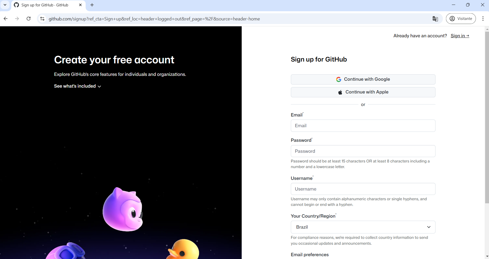
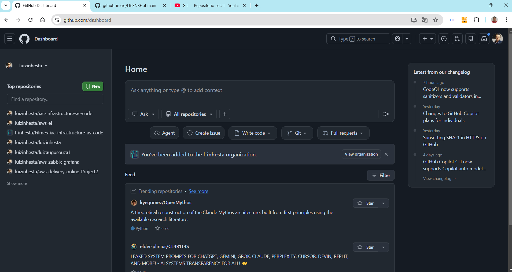
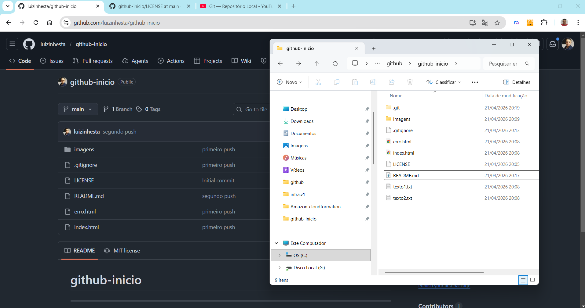
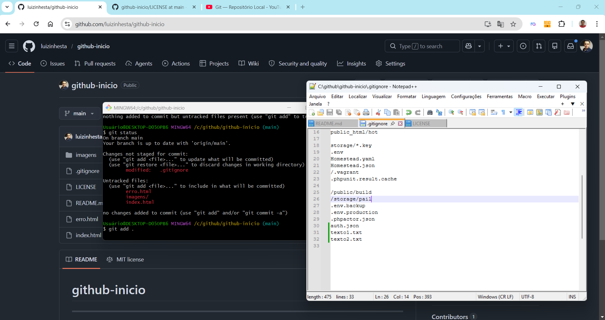
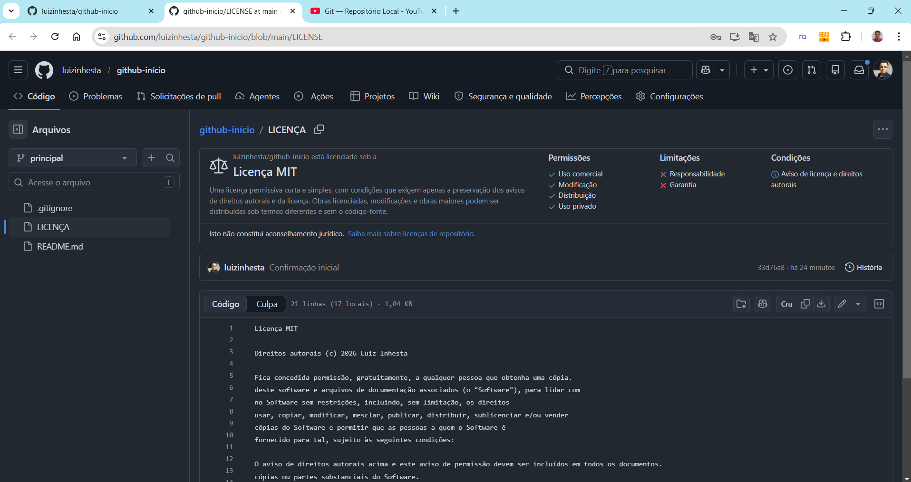
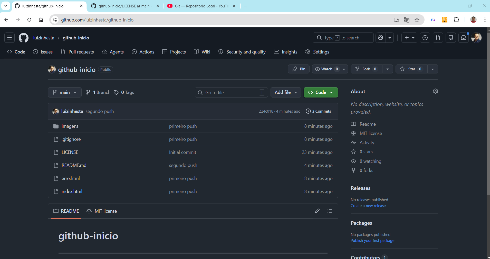

# 💻 Infrastructure as Code & CI/CD - Github - Site Filmes 2/1

## 📌 Sobre o Projeto

Este repositório tem como objetivo demonstrar, na prática, o uso básico do **GitHub** e do **Git** para controle de versão de projetos.

A proposta é apresentar um ambiente simples, contendo arquivos HTML e estrutura inicial, para exemplificar como versionar código, registrar alterações e organizar um projeto dentro do GitHub 🚀  


---

## 🎯 Objetivos

- Demonstrar o funcionamento do controle de versão com Git  
- Apresentar o fluxo básico de versionamento  
- Exemplificar a criação e organização de repositórios  
- Servir como base para estudos e projetos futuros  

---

## ⚙️ Tecnologias Utilizadas

- Git  
- GitHub 

---

## 🧭 Conceitos Abordados

Durante o desenvolvimento deste projeto, foram aplicados os seguintes conceitos:

- Criação de repositório  
- Versionamento de arquivos  
- Commits e histórico de alterações  
- Organização de arquivos no GitHub  

---

## 📸 Fotos do Projeto

<p align="center">
  
  
  
</p>

<p align="center">
  
  
  
</p>

---

## 📁 Estrutura do Projeto

```
github-inicio/
│
├── index.html        # Página principal
├── erro.html         # Página de erro
├── imagens/          # Arquivos de imagem
├── .gitignore        # Arquivos ignorados pelo Git
├── README.md         # Documentação do projeto
└── LICENSE           # Licença do projeto
```

---

## 🔄 Fluxo básico com Git

```bash
git clone URL_DO_REPOSITORIO
git status
git add .
git commit -m "mensagem do commit"
git push -u origin main
```

---

## ⚠️ Boas Práticas

- Utilizar o `.gitignore` para evitar subir arquivos desnecessários  
- Escrever mensagens de commit claras e objetivas  
- Manter o repositório organizado  
- Versionar frequentemente as alterações  

---

## 🧹 Remover versionamento Git

Caso seja necessário remover o controle de versão da pasta local:

```bash
rm -rf .git
```

---

## 📜 Licença

Este projeto está sob a licença **MIT**.

---

## 👨‍💻 Autor

**Luiz Augusto Souza**

* 💼 LinkedIn: Link
* 💻 YouTube: Link

---
